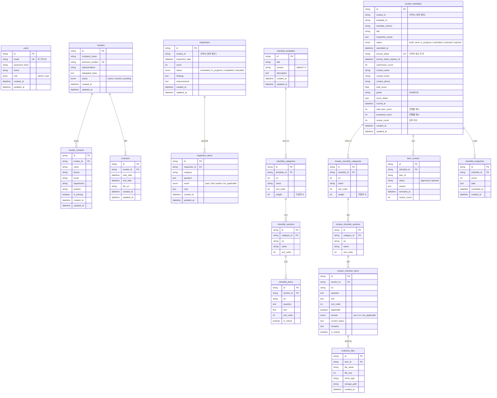

# 데이터베이스 테이블 명세서

## 개요

| 항목 | 내용 |
|------|------|
| DBMS | MySQL |
| ORM | Prisma |
| 서비스 | 3개 (Gateway, Trustee, Inspection) |
| 총 테이블 수 | 18개 |
| ID 전략 | CUID (`@default(cuid())`) |
| 타임스탬프 | `created_at`, `updated_at` (자동) |

## 데이터베이스 구성

| DB | 서비스 | 환경변수 | 테이블 수 |
|----|--------|---------|----------|
| `trustee_auth` | Gateway | `AUTH_DATABASE_URL` | 1개 |
| `trustee` | Trustee Service | `DATABASE_URL` | 3개 |
| `trustee` | Inspection Service | `DATABASE_URL` | 14개 |

---

## 1. Gateway DB (인증)

### 1.1 users (사용자)

| 컬럼명 | Prisma 필드 | 타입 | 제약조건 | 설명 |
|--------|------------|------|---------|------|
| id | id | String (CUID) | PK | 사용자 ID |
| email | email | String | UNIQUE, NOT NULL | 이메일 (로그인 ID) |
| password_hash | passwordHash | String | NOT NULL | 비밀번호 해시 |
| name | name | String | NOT NULL | 사용자 이름 |
| role | role | Enum(`admin`, `user`) | NOT NULL, DEFAULT `user` | 사용자 역할 |
| created_at | createdAt | DateTime | NOT NULL, DEFAULT now() | 생성일시 |
| updated_at | updatedAt | DateTime | NOT NULL, 자동갱신 | 수정일시 |

---

## 2. Trustee Service DB (수탁사 관리)

### 2.1 trustees (수탁사)

| 컬럼명 | Prisma 필드 | 타입 | 제약조건 | 설명 |
|--------|------------|------|---------|------|
| id | id | String (CUID) | PK | 수탁사 ID |
| company_name | companyName | String | NOT NULL | 회사명 |
| business_number | businessNumber | String | UNIQUE, NULLABLE | 사업자번호 |
| representative | representative | String | NULLABLE | 대표자명 |
| delegated_tasks | delegatedTasks | Text | NOT NULL | 위탁 업무 내용 |
| status | status | Enum(`active`, `inactive`, `pending`) | NOT NULL, DEFAULT `pending` | 수탁사 상태 |
| created_at | createdAt | DateTime | NOT NULL, DEFAULT now() | 생성일시 |
| updated_at | updatedAt | DateTime | NOT NULL, 자동갱신 | 수정일시 |

**관계:**
- `1:N` → trustee_contacts (담당자)
- `1:N` → contracts (계약)

### 2.2 trustee_contacts (수탁사 담당자)

| 컬럼명 | Prisma 필드 | 타입 | 제약조건 | 설명 |
|--------|------------|------|---------|------|
| id | id | String (CUID) | PK | 담당자 ID |
| trustee_id | trusteeId | String | FK → trustees.id, NOT NULL | 수탁사 ID |
| name | name | String | NOT NULL | 담당자 이름 |
| phone | phone | String | NULLABLE | 전화번호 |
| email | email | String | NULLABLE | 이메일 |
| department | department | String | NULLABLE | 부서 |
| position | position | String | NULLABLE | 직위 |
| is_primary | isPrimary | Boolean | NOT NULL, DEFAULT false | 주 담당자 여부 |
| created_at | createdAt | DateTime | NOT NULL, DEFAULT now() | 생성일시 |
| updated_at | updatedAt | DateTime | NOT NULL, 자동갱신 | 수정일시 |

**관계:**
- `N:1` → trustees (수탁사), ON DELETE CASCADE

### 2.3 contracts (계약)

| 컬럼명 | Prisma 필드 | 타입 | 제약조건 | 설명 |
|--------|------------|------|---------|------|
| id | id | String (CUID) | PK | 계약 ID |
| trustee_id | trusteeId | String | FK → trustees.id, NOT NULL | 수탁사 ID |
| start_date | startDate | DateTime | NOT NULL | 계약 시작일 |
| end_date | endDate | DateTime | NOT NULL | 계약 종료일 |
| file_url | fileUrl | String | NULLABLE | 계약서 파일 URL |
| created_at | createdAt | DateTime | NOT NULL, DEFAULT now() | 생성일시 |
| updated_at | updatedAt | DateTime | NOT NULL, 자동갱신 | 수정일시 |

**관계:**
- `N:1` → trustees (수탁사), ON DELETE CASCADE

---

## 3. Inspection Service DB (점검 관리)

### 3.1 점검 (레거시)

#### 3.1.1 inspections (점검)

| 컬럼명 | Prisma 필드 | 타입 | 제약조건 | 설명 |
|--------|------------|------|---------|------|
| id | id | String (CUID) | PK | 점검 ID |
| trustee_id | trusteeId | String | NOT NULL | 수탁사 ID (외부 참조) |
| inspection_date | inspectionDate | DateTime | NOT NULL | 점검일 |
| score | score | Int | NULLABLE | 점검 점수 |
| status | status | Enum(`scheduled`, `in_progress`, `completed`, `cancelled`) | NOT NULL, DEFAULT `scheduled` | 점검 상태 |
| findings | findings | Text | NULLABLE | 발견 사항 |
| improvements | improvements | Text | NULLABLE | 개선 사항 |
| created_at | createdAt | DateTime | NOT NULL, DEFAULT now() | 생성일시 |
| updated_at | updatedAt | DateTime | NOT NULL, 자동갱신 | 수정일시 |

**관계:**
- `1:N` → inspection_items (점검 항목)

#### 3.1.2 inspection_items (점검 항목)

| 컬럼명 | Prisma 필드 | 타입 | 제약조건 | 설명 |
|--------|------------|------|---------|------|
| id | id | String (CUID) | PK | 항목 ID |
| inspection_id | inspectionId | String | FK → inspections.id, NOT NULL | 점검 ID |
| category | category | String | NOT NULL | 점검 카테고리 |
| question | question | Text | NOT NULL | 점검 질문 |
| result | result | Enum(`pass`, `fail`, `partial`, `not_applicable`) | NOT NULL | 점검 결과 |
| note | note | Text | NULLABLE | 비고 |
| created_at | createdAt | DateTime | NOT NULL, DEFAULT now() | 생성일시 |
| updated_at | updatedAt | DateTime | NOT NULL, 자동갱신 | 수정일시 |

**관계:**
- `N:1` → inspections (점검), ON DELETE CASCADE

---

### 3.2 체크리스트 템플릿

#### 3.2.1 checklist_templates (체크리스트 템플릿)

| 컬럼명 | Prisma 필드 | 타입 | 제약조건 | 설명 |
|--------|------------|------|---------|------|
| id | id | String (CUID) | PK | 템플릿 ID |
| title | title | String | NOT NULL | 템플릿 제목 |
| version | version | String | NOT NULL, DEFAULT `"1.0"` | 버전 |
| description | description | Text | NULLABLE | 설명 |
| created_at | createdAt | DateTime | NOT NULL, DEFAULT now() | 생성일시 |
| updated_at | updatedAt | DateTime | NOT NULL, 자동갱신 | 수정일시 |

**관계:**
- `1:N` → checklist_categories (카테고리)

#### 3.2.2 checklist_categories (체크리스트 카테고리)

| 컬럼명 | Prisma 필드 | 타입 | 제약조건 | 설명 |
|--------|------------|------|---------|------|
| id | id | String (CUID) | PK | 카테고리 ID |
| template_id | templateId | String | FK → checklist_templates.id, NOT NULL | 템플릿 ID |
| no | no | Int | NOT NULL | 카테고리 번호 |
| name | name | String | NOT NULL | 카테고리 이름 |
| sort_order | sortOrder | Int | NOT NULL, DEFAULT 0 | 정렬 순서 |
| weight | weight | Int | NOT NULL, DEFAULT 0 | 가중치 (%) |

**관계:**
- `N:1` → checklist_templates, ON DELETE CASCADE
- `1:N` → checklist_sections (섹션)

#### 3.2.3 checklist_sections (체크리스트 섹션)

| 컬럼명 | Prisma 필드 | 타입 | 제약조건 | 설명 |
|--------|------------|------|---------|------|
| id | id | String (CUID) | PK | 섹션 ID |
| category_id | categoryId | String | FK → checklist_categories.id, NOT NULL | 카테고리 ID |
| no | no | String | NOT NULL | 섹션 번호 |
| name | name | String | NOT NULL | 섹션 이름 |
| sort_order | sortOrder | Int | NOT NULL, DEFAULT 0 | 정렬 순서 |

**관계:**
- `N:1` → checklist_categories, ON DELETE CASCADE
- `1:N` → checklist_items (항목)

#### 3.2.4 checklist_items (체크리스트 항목)

| 컬럼명 | Prisma 필드 | 타입 | 제약조건 | 설명 |
|--------|------------|------|---------|------|
| id | id | String (CUID) | PK | 항목 ID |
| section_id | sectionId | String | FK → checklist_sections.id, NOT NULL | 섹션 ID |
| no | no | String | NOT NULL | 항목 번호 |
| question | question | Text | NOT NULL | 점검 질문 |
| hint | hint | Text | NULLABLE | 작성 힌트 |
| sort_order | sortOrder | Int | NOT NULL, DEFAULT 0 | 정렬 순서 |
| is_critical | isCritical | Boolean | NOT NULL, DEFAULT false | 필수 이행 항목 여부 |

**관계:**
- `N:1` → checklist_sections, ON DELETE CASCADE

---

### 3.3 수탁사별 체크리스트 (스냅샷)

#### 3.3.1 trustee_checklists (수탁사 체크리스트)

| 컬럼명 | Prisma 필드 | 타입 | 제약조건 | 설명 |
|--------|------------|------|---------|------|
| id | id | String (CUID) | PK | 체크리스트 ID |
| trustee_id | trusteeId | String | NOT NULL | 수탁사 ID (외부 참조) |
| template_id | templateId | String | NULLABLE | 원본 템플릿 ID |
| template_version | templateVersion | String | NULLABLE | 원본 템플릿 버전 |
| title | title | String | NOT NULL | 체크리스트 제목 |
| inspection_scope | inspectionScope | Text | NULLABLE | 점검 범위 |
| status | status | Enum (아래 참조) | NOT NULL, DEFAULT `draft` | 체크리스트 상태 |
| submitted_at | submittedAt | DateTime | NULLABLE | 제출일시 |
| created_at | createdAt | DateTime | NOT NULL, DEFAULT now() | 생성일시 |
| updated_at | updatedAt | DateTime | NOT NULL, 자동갱신 | 수정일시 |
| access_token | accessToken | String (UUID) | UNIQUE, NOT NULL, 자동생성 | 수탁사 접근 토큰 |
| access_token_expires_at | accessTokenExpiresAt | DateTime | NOT NULL | 토큰 만료일시 |
| submission_count | submissionCount | Int | NOT NULL, DEFAULT 0 | 제출 횟수 |
| contact_name | contactName | String | NULLABLE | 작성자 이름 |
| contact_email | contactEmail | String | NULLABLE | 작성자 이메일 |
| contact_phone | contactPhone | String | NULLABLE | 작성자 전화번호 |
| total_score | totalScore | Float | NULLABLE | 종합 점수 (100점 만점) |
| grade | grade | VarChar(2) | NULLABLE | 등급 (S/A/B/C/D) |
| score_detail | scoreDetail | JSON | NULLABLE | 스코어링 상세 결과 |
| scored_at | scoredAt | DateTime | NULLABLE | 스코어링 일시 |
| total_item_count | totalItemCount | Int | NOT NULL, DEFAULT 0 | 총 항목 수 (진행률 캐시) |
| answered_count | answeredCount | Int | NOT NULL, DEFAULT 0 | 답변 완료 수 (진행률 캐시) |
| review_round | reviewRound | Int | NOT NULL, DEFAULT 0 | 검토 차수 |

**상태 Enum (TrusteeChecklistStatus):**

| 값 | 설명 |
|----|------|
| `draft` | 초안 (관리자가 생성) |
| `sent` | 전달됨 (수탁사에 링크 전달) |
| `in_progress` | 작성중 (수탁사가 입력 시작) |
| `submitted` | 제출완료 (수탁사가 제출) |
| `reviewed` | 검토완료 (관리자가 검토 확정) |
| `rejected` | 반려 (관리자가 반려) |

**관계:**
- `1:N` → trustee_checklist_categories (카테고리)
- `1:N` → item_reviews (항목별 검토)
- `1:N` → checklist_snapshots (제출 스냅샷)

#### 3.3.2 trustee_checklist_categories (수탁사 체크리스트 카테고리)

| 컬럼명 | Prisma 필드 | 타입 | 제약조건 | 설명 |
|--------|------------|------|---------|------|
| id | id | String (CUID) | PK | 카테고리 ID |
| checklist_id | checklistId | String | FK → trustee_checklists.id, NOT NULL | 체크리스트 ID |
| no | no | Int | NOT NULL | 카테고리 번호 |
| name | name | String | NOT NULL | 카테고리 이름 |
| sort_order | sortOrder | Int | NOT NULL, DEFAULT 0 | 정렬 순서 |
| weight | weight | Int | NOT NULL, DEFAULT 0 | 가중치 (%) |

**관계:**
- `N:1` → trustee_checklists, ON DELETE CASCADE
- `1:N` → trustee_checklist_sections (섹션)

#### 3.3.3 trustee_checklist_sections (수탁사 체크리스트 섹션)

| 컬럼명 | Prisma 필드 | 타입 | 제약조건 | 설명 |
|--------|------------|------|---------|------|
| id | id | String (CUID) | PK | 섹션 ID |
| category_id | categoryId | String | FK → trustee_checklist_categories.id, NOT NULL | 카테고리 ID |
| no | no | String | NOT NULL | 섹션 번호 |
| name | name | String | NOT NULL | 섹션 이름 |
| sort_order | sortOrder | Int | NOT NULL, DEFAULT 0 | 정렬 순서 |

**관계:**
- `N:1` → trustee_checklist_categories, ON DELETE CASCADE
- `1:N` → trustee_checklist_items (항목)

#### 3.3.4 trustee_checklist_items (수탁사 체크리스트 항목)

| 컬럼명 | Prisma 필드 | 타입 | 제약조건 | 설명 |
|--------|------------|------|---------|------|
| id | id | String (CUID) | PK | 항목 ID |
| section_id | sectionId | String | FK → trustee_checklist_sections.id, NOT NULL | 섹션 ID |
| no | no | String | NOT NULL | 항목 번호 |
| question | question | Text | NOT NULL | 점검 질문 |
| hint | hint | Text | NULLABLE | 작성 힌트 |
| sort_order | sortOrder | Int | NOT NULL, DEFAULT 0 | 정렬 순서 |
| applicable | applicable | Boolean | NOT NULL, DEFAULT true | 적용 여부 |
| answer | answer | Enum(`yes`, `no`, `not_applicable`) | NULLABLE | 답변 |
| current_status | currentStatus | Text | NULLABLE | 현재 이행 현황 |
| remarks | remarks | Text | NULLABLE | 비고 |
| is_critical | isCritical | Boolean | NOT NULL, DEFAULT false | 필수 이행 항목 여부 |

**답변 Enum (ChecklistAnswer):**

| 값 | 설명 |
|----|------|
| `yes` | 이행 (적합) |
| `no` | 미이행 (미흡) |
| `not_applicable` | 해당없음 |

**관계:**
- `N:1` → trustee_checklist_sections, ON DELETE CASCADE
- `1:N` → evidence_files (증빙 파일)

---

### 3.4 검토/반려

#### 3.4.1 item_reviews (항목별 검토)

| 컬럼명 | Prisma 필드 | 타입 | 제약조건 | 설명 |
|--------|------------|------|---------|------|
| id | id | String (CUID) | PK | 검토 ID |
| checklist_id | checklistId | String | FK → trustee_checklists.id, NOT NULL | 체크리스트 ID |
| item_id | itemId | String | NOT NULL | 항목 ID |
| status | status | String | NOT NULL | 검토 상태 (`approved`/`rejected`) |
| reason | reason | Text | NULLABLE | 반려 사유 |
| reviewed_at | reviewedAt | DateTime | NOT NULL, DEFAULT now() | 검토일시 |
| review_round | reviewRound | Int | NOT NULL | 검토 차수 |

**인덱스:**
- `(checklist_id, review_round)` - 차수별 검토 조회
- `(item_id)` - 항목별 검토 이력

**관계:**
- `N:1` → trustee_checklists, ON DELETE CASCADE

#### 3.4.2 checklist_snapshots (체크리스트 스냅샷)

| 컬럼명 | Prisma 필드 | 타입 | 제약조건 | 설명 |
|--------|------------|------|---------|------|
| id | id | String (CUID) | PK | 스냅샷 ID |
| checklist_id | checklistId | String | FK → trustee_checklists.id, NOT NULL | 체크리스트 ID |
| round | round | Int | NOT NULL | 제출 차수 |
| data | data | JSON | NOT NULL | 전체 체크리스트 데이터 스냅샷 |
| submitted_at | submittedAt | DateTime | NOT NULL | 제출일시 |
| created_at | createdAt | DateTime | NOT NULL, DEFAULT now() | 생성일시 |

**유니크 제약:**
- `(checklist_id, round)` - 체크리스트별 차수 유일

**관계:**
- `N:1` → trustee_checklists, ON DELETE CASCADE

---

### 3.5 증빙 파일

#### 3.5.1 evidence_files (증빙 파일)

| 컬럼명 | Prisma 필드 | 타입 | 제약조건 | 설명 |
|--------|------------|------|---------|------|
| id | id | String (CUID) | PK | 파일 ID |
| item_id | itemId | String | FK → trustee_checklist_items.id, NOT NULL | 항목 ID |
| file_name | fileName | String | NOT NULL | 원본 파일명 |
| file_size | fileSize | Int | NOT NULL | 파일 크기 (bytes) |
| mime_type | mimeType | String | NOT NULL | MIME 타입 |
| storage_path | storagePath | String | NOT NULL | 서버 저장 경로 |
| created_at | createdAt | DateTime | NOT NULL, DEFAULT now() | 생성일시 |

**관계:**
- `N:1` → trustee_checklist_items, ON DELETE CASCADE

---

## 4. ER 다이어그램

> 이미지: `docs/erd.png`



### 테이블 관계 요약

```
[Gateway DB - auth]
  users (1개)

[Trustee Service DB]
  trustees ──┬── trustee_contacts    (1:N, CASCADE)
             └── contracts            (1:N, CASCADE)

[Inspection Service DB]
  inspections ── inspection_items     (1:N, CASCADE)

  checklist_templates                          ← Root 템플릿
    └── checklist_categories                   (1:N, CASCADE)
        └── checklist_sections                 (1:N, CASCADE)
            └── checklist_items                (1:N, CASCADE)

  trustee_checklists ──┬── trustee_checklist_categories   (1:N, CASCADE)
    (수탁사 스냅샷)     │    └── trustee_checklist_sections (1:N, CASCADE)
                       │        └── trustee_checklist_items (1:N, CASCADE)
                       │            └── evidence_files      (1:N, CASCADE)
                       ├── item_reviews                     (1:N, CASCADE)
                       └── checklist_snapshots              (1:N, CASCADE)
```

---

## 5. 스코어링 관련 필드 요약

점검 시스템 고도화로 추가된 스코어링 관련 필드:

| 테이블 | 추가 컬럼 | 용도 |
|--------|----------|------|
| trustee_checklists | total_score, grade, score_detail, scored_at | 스코어링 결과 저장 |
| trustee_checklists | total_item_count, answered_count | 진행률 캐시 |
| checklist_categories | weight | 카테고리 가중치 (%) |
| trustee_checklist_categories | weight | 가중치 스냅샷 |
| checklist_items | is_critical | 필수 이행 항목 플래그 |
| trustee_checklist_items | is_critical | 필수 이행 플래그 스냅샷 |

### 등급 체계

| 등급 | 점수 범위 | 후속 조치 |
|------|----------|----------|
| S | 90점 이상 | 차기 점검 주기 연장 (12개월) |
| A | 80~89점 | 정기 점검 유지 |
| B | 70~79점 | 3개월 내 개선 계획 수립 |
| C | 60~69점 | 1개월 내 개선, 3개월 내 재점검 |
| D | 60점 미만 | 즉시 개선, 계약 재검토 |

> 필수 이행 항목(6개) 미이행 시 최고 등급 B로 제한
